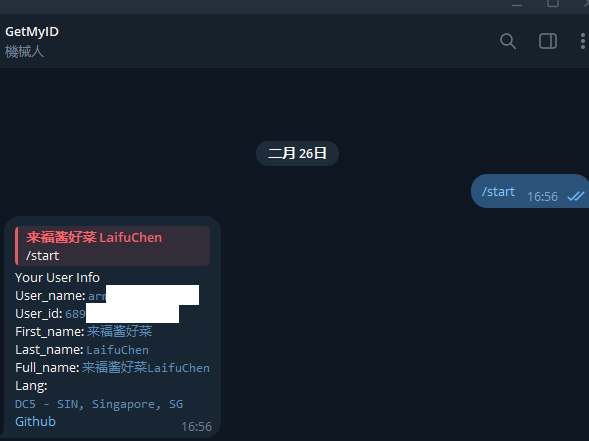

# TeleGetid

TeleGetid is a simple Telegram bot that allows you to retrieve user IDs. It is built using the [telebot](https://github.com/tucnak/telebot) framework.

## Features
- Retrieve Telegram user IDs quickly and easily.
- Simple setup and usage.

## Online use
[tele_get_id_bot](https://t.me/tele_get_id_bot)



## How to use

### Windows
[Download](https://github.com/pmaru-top/telegetid/releases/download/1.0.0/telegetid_windows_amd64) and run

### linux_amd64

### OneClick
```sh
bash <(curl -L -s https://raw.githubusercontent.com/TeleGetid/refs/heads/main/1click.sh)
```

## How to get bot token
- [@BotFather](https://t.me/BotFather)

## Build manually
```sh
go build -trimpath -ldflags "-s -w -buildid=" -o bin/telegetid ./main
```

or build scripts [build.ps1](build.ps1) (only windows)

## License
This project is licensed under the MIT License.